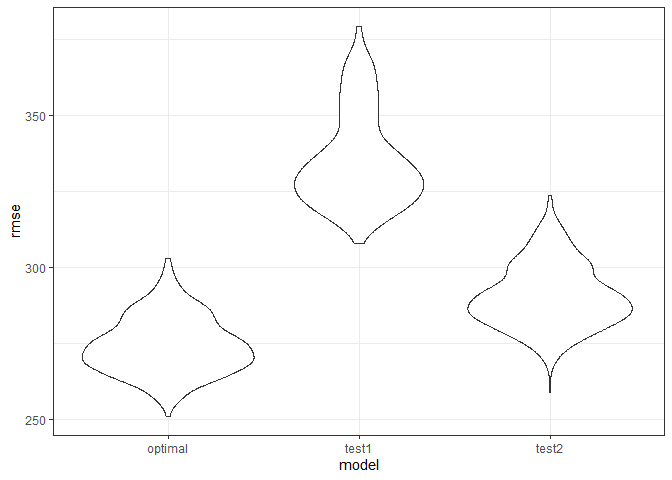

hw6-sx2267
================
ShibeiXu
2021/12/4

## Problem 1

``` r
data1 = read.csv("birthweight.csv")%>% 
  as.tibble() %>% 
  janitor::clean_names()
```

``` r
data1 =
  data1 %>% 
  mutate(babysex = factor(babysex),
         malform = factor(malform),
         mrace = factor(mrace, levels = c(1, 2, 3, 4, 8)))
```

``` r
summary(data1)
```

    ##  babysex      bhead          blength           bwt           delwt      
    ##  1:2230   Min.   :21.00   Min.   :20.00   Min.   : 595   Min.   : 86.0  
    ##  2:2112   1st Qu.:33.00   1st Qu.:48.00   1st Qu.:2807   1st Qu.:131.0  
    ##           Median :34.00   Median :50.00   Median :3132   Median :143.0  
    ##           Mean   :33.65   Mean   :49.75   Mean   :3114   Mean   :145.6  
    ##           3rd Qu.:35.00   3rd Qu.:51.00   3rd Qu.:3459   3rd Qu.:157.0  
    ##           Max.   :41.00   Max.   :63.00   Max.   :4791   Max.   :334.0  
    ##     fincome          frace          gaweeks      malform     menarche    
    ##  Min.   : 0.00   Min.   :1.000   Min.   :17.70   0:4327   Min.   : 0.00  
    ##  1st Qu.:25.00   1st Qu.:1.000   1st Qu.:38.30   1:  15   1st Qu.:12.00  
    ##  Median :35.00   Median :2.000   Median :39.90            Median :12.00  
    ##  Mean   :44.11   Mean   :1.655   Mean   :39.43            Mean   :12.51  
    ##  3rd Qu.:65.00   3rd Qu.:2.000   3rd Qu.:41.10            3rd Qu.:13.00  
    ##  Max.   :96.00   Max.   :8.000   Max.   :51.30            Max.   :19.00  
    ##     mheight          momage     mrace        parity            pnumlbw 
    ##  Min.   :48.00   Min.   :12.0   1:2147   Min.   :0.000000   Min.   :0  
    ##  1st Qu.:62.00   1st Qu.:18.0   2:1909   1st Qu.:0.000000   1st Qu.:0  
    ##  Median :63.00   Median :20.0   3:  43   Median :0.000000   Median :0  
    ##  Mean   :63.49   Mean   :20.3   4: 243   Mean   :0.002303   Mean   :0  
    ##  3rd Qu.:65.00   3rd Qu.:22.0   8:   0   3rd Qu.:0.000000   3rd Qu.:0  
    ##  Max.   :77.00   Max.   :44.0            Max.   :6.000000   Max.   :0  
    ##     pnumsga      ppbmi            ppwt           smoken           wtgain      
    ##  Min.   :0   Min.   :13.07   Min.   : 70.0   Min.   : 0.000   Min.   :-46.00  
    ##  1st Qu.:0   1st Qu.:19.53   1st Qu.:110.0   1st Qu.: 0.000   1st Qu.: 15.00  
    ##  Median :0   Median :21.03   Median :120.0   Median : 0.000   Median : 22.00  
    ##  Mean   :0   Mean   :21.57   Mean   :123.5   Mean   : 4.145   Mean   : 22.08  
    ##  3rd Qu.:0   3rd Qu.:22.91   3rd Qu.:134.0   3rd Qu.: 5.000   3rd Qu.: 28.00  
    ##  Max.   :0   Max.   :46.10   Max.   :287.0   Max.   :60.000   Max.   : 89.00

``` r
#we see there is all 0s in multiple variables
data1 =
  data1 %>% 
  select(-pnumlbw, -pnumsga)
```

``` r
lm(bwt ~ ., data = data1) %>% 
  step(direction='backward')
```

    ## Start:  AIC=48713.22
    ## bwt ~ babysex + bhead + blength + delwt + fincome + frace + gaweeks + 
    ##     malform + menarche + mheight + momage + mrace + parity + 
    ##     ppbmi + ppwt + smoken + wtgain
    ## 
    ## 
    ## Step:  AIC=48713.22
    ## bwt ~ babysex + bhead + blength + delwt + fincome + frace + gaweeks + 
    ##     malform + menarche + mheight + momage + mrace + parity + 
    ##     ppbmi + ppwt + smoken
    ## 
    ##            Df Sum of Sq       RSS   AIC
    ## - malform   1      1363 320828713 48711
    ## - ppbmi     1      7137 320834486 48711
    ## - frace     1     21354 320848704 48712
    ## - momage    1     28008 320855358 48712
    ## - mheight   1     69601 320896951 48712
    ## - menarche  1    113204 320940554 48713
    ## - ppwt      1    134543 320961893 48713
    ## <none>                  320827350 48713
    ## - fincome   1    187792 321015141 48714
    ## - parity    1    414078 321241428 48717
    ## - babysex   1    852506 321679856 48723
    ## - gaweeks   1   4623434 325450784 48773
    ## - smoken    1   5044423 325871772 48779
    ## - delwt     1   8022697 328850047 48818
    ## - mrace     3   9323057 330150407 48832
    ## - blength   1 101987032 422814382 49910
    ## - bhead     1 106655866 427483216 49957
    ## 
    ## Step:  AIC=48711.24
    ## bwt ~ babysex + bhead + blength + delwt + fincome + frace + gaweeks + 
    ##     menarche + mheight + momage + mrace + parity + ppbmi + ppwt + 
    ##     smoken
    ## 
    ##            Df Sum of Sq       RSS   AIC
    ## - ppbmi     1      7091 320835804 48709
    ## - frace     1     21438 320850151 48710
    ## - momage    1     28279 320856992 48710
    ## - mheight   1     69424 320898137 48710
    ## - menarche  1    113505 320942218 48711
    ## - ppwt      1    134478 320963191 48711
    ## <none>                  320828713 48711
    ## - fincome   1    187192 321015905 48712
    ## - parity    1    413878 321242591 48715
    ## - babysex   1    851682 321680395 48721
    ## - gaweeks   1   4622278 325450991 48771
    ## - smoken    1   5043342 325872055 48777
    ## - delwt     1   8038554 328867267 48817
    ## - mrace     3   9326260 330154973 48830
    ## - blength   1 102000977 422829690 49908
    ## - bhead     1 106668014 427496727 49956
    ## 
    ## Step:  AIC=48709.34
    ## bwt ~ babysex + bhead + blength + delwt + fincome + frace + gaweeks + 
    ##     menarche + mheight + momage + mrace + parity + ppwt + smoken
    ## 
    ##            Df Sum of Sq       RSS   AIC
    ## - frace     1     21275 320857079 48708
    ## - momage    1     28834 320864638 48708
    ## - menarche  1    115123 320950926 48709
    ## <none>                  320835804 48709
    ## - fincome   1    188621 321024425 48710
    ## - parity    1    412365 321248169 48713
    ## - babysex   1    850406 321686210 48719
    ## - mheight   1   1068775 321904579 48722
    ## - ppwt      1   2930732 323766536 48747
    ## - gaweeks   1   4619752 325455556 48769
    ## - smoken    1   5047518 325883322 48775
    ## - delwt     1   8034327 328870131 48815
    ## - mrace     3   9319520 330155324 48828
    ## - blength   1 102010441 422846244 49906
    ## - bhead     1 106814729 427650532 49955
    ## 
    ## Step:  AIC=48707.63
    ## bwt ~ babysex + bhead + blength + delwt + fincome + gaweeks + 
    ##     menarche + mheight + momage + mrace + parity + ppwt + smoken
    ## 
    ##            Df Sum of Sq       RSS   AIC
    ## - momage    1     29211 320886290 48706
    ## - menarche  1    117635 320974714 48707
    ## <none>                  320857079 48708
    ## - fincome   1    195199 321052278 48708
    ## - parity    1    412984 321270064 48711
    ## - babysex   1    850020 321707099 48717
    ## - mheight   1   1078673 321935752 48720
    ## - ppwt      1   2934023 323791103 48745
    ## - gaweeks   1   4621504 325478583 48768
    ## - smoken    1   5039368 325896447 48773
    ## - delwt     1   8024939 328882018 48813
    ## - mrace     3  13551444 334408523 48881
    ## - blength   1 102018559 422875638 49904
    ## - bhead     1 106821342 427678421 49953
    ## 
    ## Step:  AIC=48706.02
    ## bwt ~ babysex + bhead + blength + delwt + fincome + gaweeks + 
    ##     menarche + mheight + mrace + parity + ppwt + smoken
    ## 
    ##            Df Sum of Sq       RSS   AIC
    ## - menarche  1    100121 320986412 48705
    ## <none>                  320886290 48706
    ## - fincome   1    240800 321127090 48707
    ## - parity    1    431433 321317724 48710
    ## - babysex   1    841278 321727568 48715
    ## - mheight   1   1076739 321963029 48719
    ## - ppwt      1   2913653 323799943 48743
    ## - gaweeks   1   4676469 325562760 48767
    ## - smoken    1   5045104 325931394 48772
    ## - delwt     1   8000672 328886962 48811
    ## - mrace     3  14667730 335554021 48894
    ## - blength   1 101990556 422876847 49902
    ## - bhead     1 106864308 427750598 49952
    ## 
    ## Step:  AIC=48705.38
    ## bwt ~ babysex + bhead + blength + delwt + fincome + gaweeks + 
    ##     mheight + mrace + parity + ppwt + smoken
    ## 
    ##           Df Sum of Sq       RSS   AIC
    ## <none>                 320986412 48705
    ## - fincome  1    245637 321232048 48707
    ## - parity   1    422770 321409181 48709
    ## - babysex  1    846134 321832545 48715
    ## - mheight  1   1012240 321998651 48717
    ## - ppwt     1   2907049 323893461 48743
    ## - gaweeks  1   4662501 325648912 48766
    ## - smoken   1   5073849 326060260 48771
    ## - delwt    1   8137459 329123871 48812
    ## - mrace    3  14683609 335670021 48894
    ## - blength  1 102191779 423178191 49903
    ## - bhead    1 106779754 427766166 49950

    ## 
    ## Call:
    ## lm(formula = bwt ~ babysex + bhead + blength + delwt + fincome + 
    ##     gaweeks + mheight + mrace + parity + ppwt + smoken, data = data1)
    ## 
    ## Coefficients:
    ## (Intercept)     babysex2        bhead      blength        delwt      fincome  
    ##   -6098.822       28.558      130.777       74.947        4.107        0.318  
    ##     gaweeks      mheight       mrace2       mrace3       mrace4       parity  
    ##      11.592        6.594     -138.792      -74.887     -100.678       96.305  
    ##        ppwt       smoken  
    ##      -2.676       -4.843

Based on the stepwise model, the final model are: babysex + bhead +
blength + delwt + fincome + gaweeks + mheight + mrace + parity + ppwt +
smoken

``` r
model1 = lm(bwt ~ babysex + bhead + blength + delwt + fincome + gaweeks + mheight + mrace + parity + ppwt + smoken, data = data1)
data1 %>% 
  modelr::add_predictions(model1) %>% 
  modelr::add_residuals(model1) %>% 
  ggplot(aes(x = pred, y = resid)) + 
  geom_point(aes(alpha = 0.5)) +
  theme(legend.position = "none")
```


``` r
compare_df1 = 
  modelr::crossv_mc(data1, 500) %>% 
  mutate(train = map(train, as.tibble), 
         test = map(test, as.tibble)) %>% 
  mutate(model1 = map(train, ~lm(bwt ~ babysex + bhead + blength + delwt + fincome + gaweeks + mheight + mrace + parity + ppwt + smoken, data = .x)), 
         test1_mod = map(train, ~lm(bwt ~ blength + gaweeks, data = .x)), 
         test2_mod = map(train, ~lm(bwt ~ bhead+blength+babysex+bhead * blength * babysex, data = .x))) %>% 
  mutate(rmse_optimal = map2_dbl(model1, test, ~modelr::rmse(model = .x, data = .y)), 
         rmse_test1 = map2_dbl(test1_mod, test, ~modelr::rmse(model = .x, data = .y)),
         rmse_test2 = map2_dbl(test2_mod, test, ~modelr::rmse(model = .x, data = .y)))
```

``` r
compare_df1 %>% 
  select(starts_with("rmse")) %>% 
  gather(key = model, value = rmse) %>% 
  mutate(model = str_replace(model, "rmse_", ""),
         model = fct_inorder(model)) %>% 
  ggplot(aes(x = model, y = rmse)) + geom_violin()
```


The optimal model has the highest prediction accuracy.

## Problem 2

``` r
weather_df = 
  rnoaa::meteo_pull_monitors(
    c("USW00094728"),
    var = c("PRCP", "TMIN", "TMAX"), 
    date_min = "2017-01-01",
    date_max = "2017-12-31") %>%
  mutate(
    name = recode(id, USW00094728 = "CentralPark_NY"),
    tmin = tmin / 10,
    tmax = tmax / 10) %>%
  select(name, id, everything())
```

``` r
head(weather_df,10)
```

    ## # A tibble: 10 x 6
    ##    name           id          date        prcp  tmax  tmin
    ##    <chr>          <chr>       <date>     <dbl> <dbl> <dbl>
    ##  1 CentralPark_NY USW00094728 2017-01-01     0   8.9   4.4
    ##  2 CentralPark_NY USW00094728 2017-01-02    53   5     2.8
    ##  3 CentralPark_NY USW00094728 2017-01-03   147   6.1   3.9
    ##  4 CentralPark_NY USW00094728 2017-01-04     0  11.1   1.1
    ##  5 CentralPark_NY USW00094728 2017-01-05     0   1.1  -2.7
    ##  6 CentralPark_NY USW00094728 2017-01-06    13   0.6  -3.8
    ##  7 CentralPark_NY USW00094728 2017-01-07    81  -3.2  -6.6
    ##  8 CentralPark_NY USW00094728 2017-01-08     0  -3.8  -8.8
    ##  9 CentralPark_NY USW00094728 2017-01-09     0  -4.9  -9.9
    ## 10 CentralPark_NY USW00094728 2017-01-10     0   7.8  -6

``` r
summary(weather_df)
```

    ##      name                id                 date                 prcp       
    ##  Length:365         Length:365         Min.   :2017-01-01   Min.   :  0.00  
    ##  Class :character   Class :character   1st Qu.:2017-04-02   1st Qu.:  0.00  
    ##  Mode  :character   Mode  :character   Median :2017-07-02   Median :  0.00  
    ##                                        Mean   :2017-07-02   Mean   : 31.36  
    ##                                        3rd Qu.:2017-10-01   3rd Qu.: 13.00  
    ##                                        Max.   :2017-12-31   Max.   :770.00  
    ##       tmax            tmin        
    ##  Min.   :-7.70   Min.   :-12.700  
    ##  1st Qu.: 9.40   1st Qu.:  2.800  
    ##  Median :18.30   Median : 10.600  
    ##  Mean   :17.37   Mean   :  9.774  
    ##  3rd Qu.:25.60   3rd Qu.: 17.800  
    ##  Max.   :34.40   Max.   : 25.000

``` r
boot_sample = function(df) {
  sample_frac(df, replace = TRUE)
}
```

``` r
boot_strap = 
  data_frame(
    strap_number = 1:5000,
    strap_sample = rerun(5000, boot_sample(weather_df))
  )
bootstrap_result = 
  boot_strap %>% 
  mutate(
    models = map(strap_sample, ~lm(tmax ~ tmin, data = .x) ),
    results = map(models, broom::glance)) %>% 
  select(-strap_sample, -models) %>% 
  unnest(results) 
```

``` r
bootstrap_result %>%
  ggplot(aes(x = adj.r.squared)) + 
  geom_density()
```


The CI of adjusted R square is 0.8933605 , 0.9270393

``` r
log_beta_p = function(df) {
    log(df[1,2]*df[2,2]) %>% 
    tibble() %>% 
    mutate(
      log_betas=.$estimate) %>% 
    select(log_betas)
}
```

``` r
bootstrap_result_1=
  boot_strap %>% 
  mutate(
    models = map(strap_sample, ~lm(tmax ~ tmin, data = .x) ),
    results = map(models, broom::tidy),
    log_betas = map(results, log_beta_p)) %>% 
  select(-strap_sample, -models) %>%
  unnest(log_betas)
```

``` r
bootstrap_result_1%>%
  ggplot(aes(x = log_betas)) + 
  geom_density()
```


The density plot indicates a normal distribution with mean centered
around 2-2.05 The CI of adjusted R square is 1.9650217 , 2.0596064
